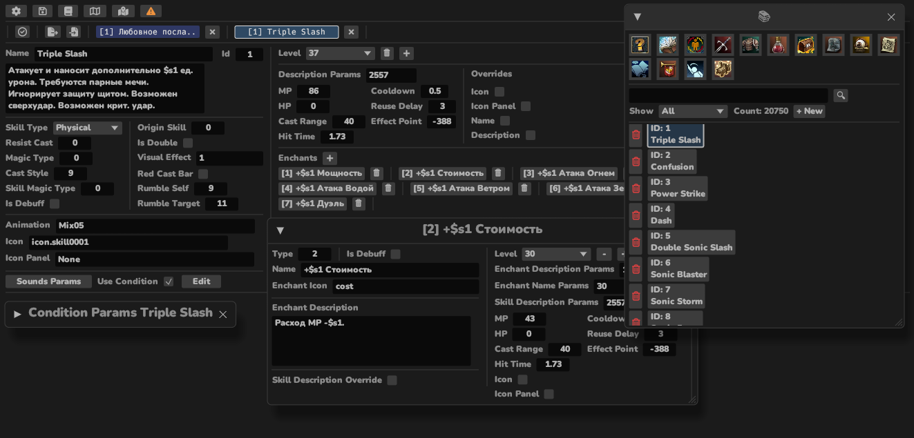

# Overview
This tool began as a small app for working with L2 client quest files and has evolved into a full-fledged .dat editor with additional functionality.
L2w_tool is written in Rust and does not depend on any other common L2 software, such as l2encdec or ACME tools.
However, it does rely on OpenSSL development libraries, making compilation for Windows a hassle. _(There are plans to replace OpenSSL with a pure Rust solution.)_
___
## Dat Editor
### Description
The main idea behind this software is to consolidate .dat files and work with the final game entities, rather than managing multiple files simultaneously, as in L2DatEditor.
### Usage
Define path to system folder in settings

Optionally define path to quest scripts folder

Press __Entity Catalog__ top menu button to open entity catalog


### Entities
- [x] Skill _(skillsoundsource,msconditiondata, skillname, skillgrp, skillsoundgrp )_
- [x] Npc _(npcgrp, additionalnpcgrpparts, npcname-ru, mobskillanimgrp)_
- [x] Quest _(questname)_
- [x] Recipe _(recipe)_
- [x] Items _(additionalitemgrp, itemstatdata, item_baseinfo, itemname)_
    - [x] Weapon _(weapongrp)_
    - [x] Armor _(armorgrp)_
    - [x] Etc _(etcitemgrp)_
- [x] Item Set _(setitemgrp)_
- [x] Hunting Zone _(huntingzone)_
- [ ] Weapon Enchant Effect
- [ ] Armor Enchant Effect
- [ ] Ensoul
- [ ] Instant Zone
- [x] Daily Missions _(onedayreward)_
- [x] Map Regions _(zonename, minimapregion)_
- [x] Raid Info _(raiddata)_
- [ ] Lifestone Options
- [x] Animation Combo _(animationcombo)_
- [x] Residence _(castlename)_
### Features
- [x] .dat enc/dec, ser/de
- [x] Autosave opened tabs _(to .asave file, Bincode format)_
- [x] Import/Export for Entities _(in Ron format)_
- [x] Search by:
    - [x] IDs
    - [x] ID ranges _(r:START-END, r:START)_
    - [x] Custom fields _(mesh:String, texture:String, effect:String, rb: u32(RaidId) )_
- [ ] String dats editor
  - [x] Npc Strings _(npstring)_
  - [x] System Strings _(sysstring)_
  - [ ] System Message _(systemmsg)_
  - [ ] Server Name _(servername)_
- [ ] Graph based quest step editor
- [x] Modified status for opened Entities
- [x] Delete Entity
- [x] Modified/deleted status in catalogs
- [x] In app logs 
- [x] Search history
- [x] Quest script template generation + editor
- [x] Dump all entities to .ron
___
## Spawn viewer
### Description
This software displays NPC spawns on the game map. The spawn data is parsed from XML files that follow the common L2J schema.
```
<!ELEMENT list (spawn|territory)*>
<!ELEMENT spawn (debug|territory|npc|point|territoryName)*>
<!ATTLIST spawn
	group CDATA #IMPLIED
	respawn CDATA #IMPLIED
	count CDATA #IMPLIED
	respawn_random CDATA #IMPLIED
	period_of_day CDATA #IMPLIED
	maker CDATA #IMPLIED>
<!ELEMENT debug (#PCDATA)>
<!ATTLIST debug
	name CDATA #IMPLIED
	val CDATA #IMPLIED>
<!ELEMENT territory (banned_territory|add)*>
<!ATTLIST territory
	name CDATA #IMPLIED
	name_debug CDATA #IMPLIED
	superPoint CDATA #IMPLIED>
<!ELEMENT territoryName (#PCDATA)>
<!ATTLIST territoryName
	name CDATA #IMPLIED>
<!ELEMENT banned_territory (add)*>
<!ELEMENT add (#PCDATA)>
<!ATTLIST add
	x CDATA #REQUIRED
	y CDATA #REQUIRED
	zmin CDATA #REQUIRED
	zmax CDATA #REQUIRED>
<!ELEMENT npc (set)*>
<!ATTLIST npc
	id CDATA #REQUIRED
	max CDATA #IMPLIED>
<!ELEMENT set (#PCDATA)>
<!ATTLIST set
	name CDATA #REQUIRED
	value CDATA #REQUIRED>
<!ELEMENT point (#PCDATA)>
<!ATTLIST point
	x CDATA #REQUIRED
	y CDATA #REQUIRED
	z CDATA #REQUIRED
	h CDATA #IMPLIED
	superPoint CDATA #IMPLIED>
 ```
### Usage
Define path to folder with spawn files in settings

Press __Spawn Viewer__ top menu button to open spawn viewer window


### Features
- [x] Show spawns for NpcId
- [x] Show spawns in selected region
- [x] Draw polygon and display in:
  - [x] Spawn format
  - [x] Zone format
  - [x] Custom format
- [ ] Draw multiple polygons
- [ ] Show spawn walk paths
- [ ] Map layers _(for dungeons/towers)_
- [ ] Z coord from geodata
___
### Dev TODO
- [x] Parallel save to .dat
- [ ] Parallel load from .dat
- [ ] Verbose errors
- [ ] Get rid of openssl dependency
---
